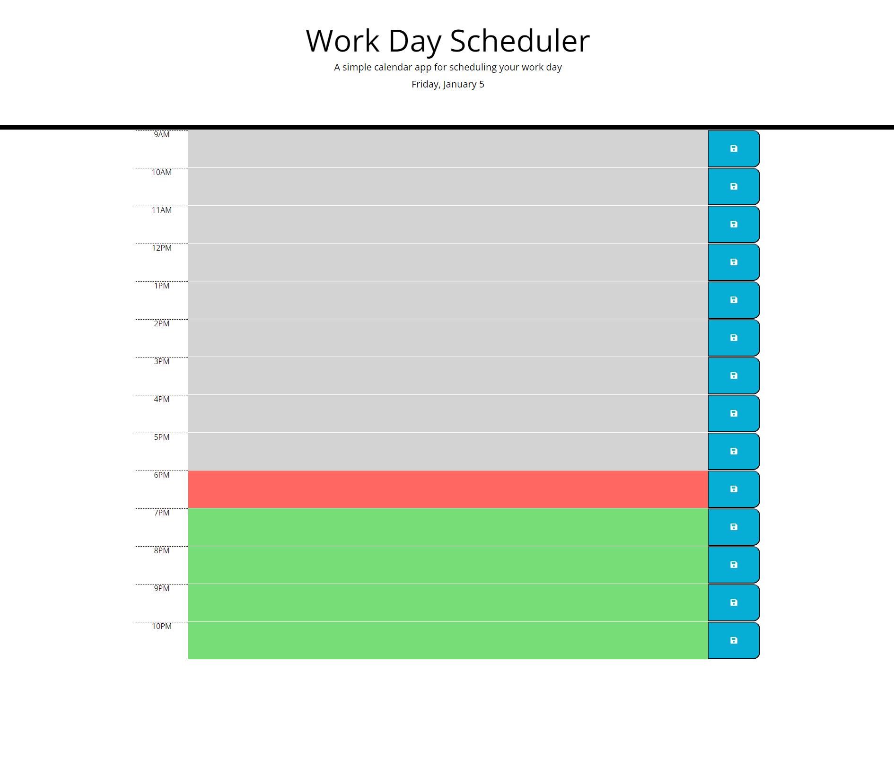

# Work Day Scheduler

## Description
The Work Day Scheduler is a simple yet powerful calendar application designed to help busy employees manage their daily schedule effectively. Utilizing jQuery for dynamic HTML and CSS updates, and incorporating the Day.js library for accurate date and time handling, this browser-based app provides a user-friendly interface for event planning and time management.

## Table of Contents

  - [Description](#description)
  - [Installation](#installation)
  - [Usage](#usage)
  - [Features](#features)
  - [Screenshot and links](#screenshot-and-links)
  - [Credits](#credits)
  - [Technologies Used](#technologies-used)

## Installation

To install this application:

1. Clone the repository from GitHub.

2. Open the **'index.html'** file in a modern web browser.

&nbsp;&nbsp;&nbsp;&nbsp;&nbsp;&nbsp;You can clone the repository to your local machine! In Bash type:

&nbsp;&nbsp;&nbsp;&nbsp;&nbsp;&nbsp;`git clone https://github.com/MrKatrish/work_day_scheduler`

## Usage

1. Click on a time block to add an event.

2. Type in your event details.

3. Click the save button to store the event in local storage.

4. Events will be retained even after the browser is refreshed.

## Features

- **Dynamic Date Display:** Shows the current day at the top of the calendar.

- **Interactive Time Blocks:** Editable blocks for each hour of the standard business day.

- **Color-Coded Blocks:** Time blocks are color-coded to indicate past, present, or future.

- **Local Storage Integration:** Events are saved locally to persist between sessions.

## Screenshot and links

### Link to my application

https://mrkatrish.github.io/work_day_scheduler/

## Credits

Special thanks to everyone who contributed to the development of this project:

- The instructor and teaching assistant from edX School for their support, valuable insights, and dedicated tutoring.
- Day.js Team for their comprehensive date-time management library.
- jQuery for simplifying HTML document traversal and manipulation.
- The [Mozilla Developer Network](https://developer.mozilla.org/en-US/) and [W3Schools](https://www.w3schools.com/) for excellent documentation and assistance in understanding web technologies.
- My amazing group mates for collaboration, idea exchange, and creating a positive atmosphere.

Thanks for your dedication and support!

## Technologies Used
- HTML5
- CSS3
- jQuery
- Day.js